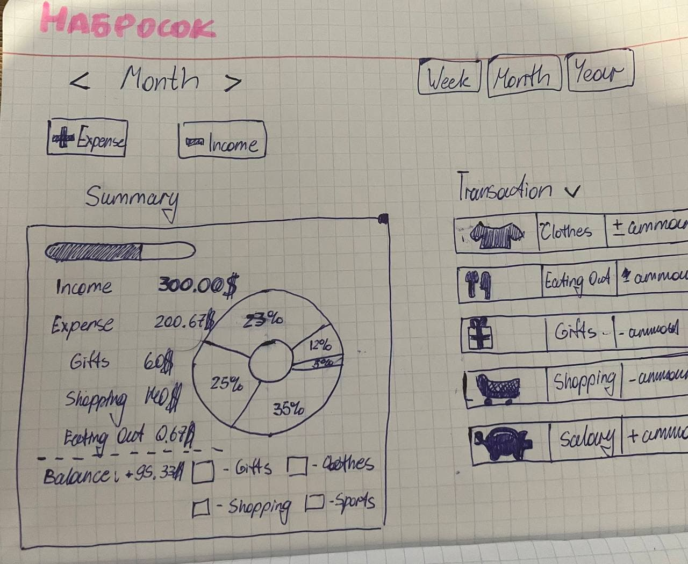
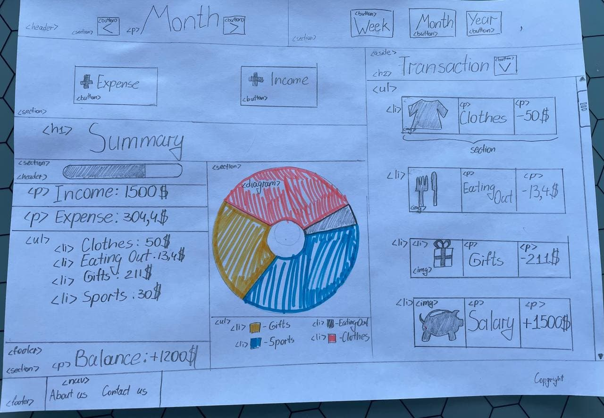

# PocketTracker
Brief description of application - Financial Tracker **PocketTracker**
+ [Developer info](#DevInfo)
+ [Application description](#AppDescr)
+ [Functional](#Func)
+ [Wireframe](#Wireframe)

##  Developer info:
1.  *Full name* : **Lozko Danila**
2.  *Group number* : **953503**
##  Application description:
### **Finance tracker**

Personal finance tracker. You can record all your spendings and income to
understand where does your money actually go.

P.S. I chose this topic besause this sphere is close to me since i start exploring financial literacy. And one of
the most important rule is to keep track your expenses.
##  Functional:
+ Transaction list (Add / Edit / Remove transaction functions).
  + Two types of transactions: income / expense
+ Each transaction should contain following data: amount, place
  + Categories for transactions (Add / Edit / Remove category functions)
+ Financial diagram which is divided into sectors that show spending for a certain period.
+ Expenses shortlist
+ Changing month and changing hole time interval(week, month, year).
+ Transaction filter(by date, by ammount, by alphabet).
+ Total ammount and sidebar.
##  Wireframe:
**1. First draft version of project(desktop version).**

**2. Mock-up(desktop version).**

